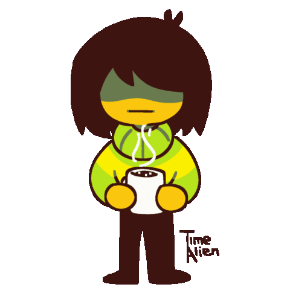

## Hello! I'm Kaique Campos M. 👋  


<p>
  I'm a passionate <strong>fullstack developer specializing in frontend</strong>, <br/>
  who enjoys crafting logic and solving problems through coding. 
</p>

<a href="https://linkedin.com/in/kaiquecamposm" target="_blank">
  
</a>

### About me

```js
const kiq = {
  pronouns: 'He' | 'Him',
  programming: [ Javascript, Typescript, ],
  front_end: [ React, Tailwind ],
  back_end: [ Nodejs, Docker ],
  currently_learning: [ Algorithms, Rust ],
}
```

---

<em> "Life is like riding a bicycle. To keep your **balance**, you must **keep moving.**" - Albert Einstein </em>
